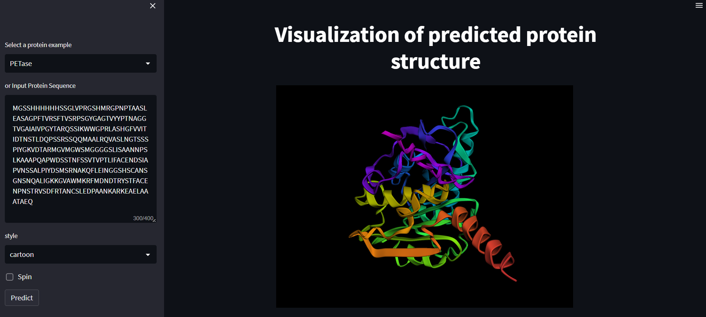

## EMSFold Protein Structure Prediction

Protein structure prediction web application built using the Streamlit framework in Python. It allows a user to either select a pre-defined protein sequence or input their own sequence, which is then sent to the ESMFold API for structure prediction. The API returns a PDB file that is then visualized in the app using the py3Dmol library. The user can also specify the visual style of the protein structure, as well as the option to spin the visualization.

## Motivation

The motivation behind this project stems from the cutting-edge work of the Meta Fundamental AI Research Protein Team (FAIR) and their development of the ESMFold model. Additionally, the app takes inspiration from the expertise of Dr. Chanin Nantasenamat, *aka* the **dataprofessor**.

## Example

## Demo App

## Contributors

Shaheer Syed

